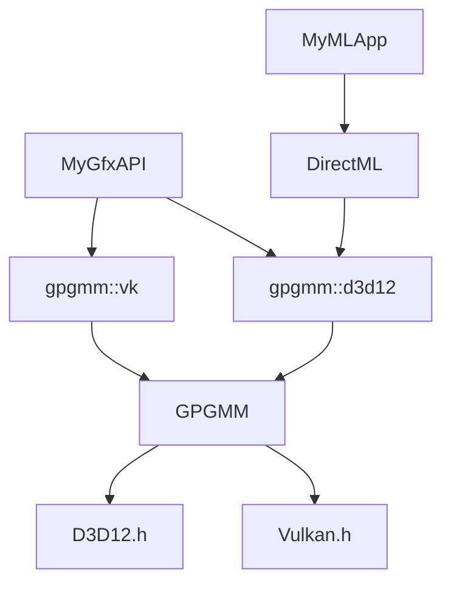

[](https://github.com/intel/GPGMM/actions/workflows/win_clang_rel_x64.yaml)
[](https://github.com/intel/GPGMM/actions/workflows/win_clang_dbg_x64.yaml)
[](https://github.com/intel/GPGMM/actions/workflows/win_msvc_dbg_x64.yaml)
[](https://github.com/intel/GPGMM/actions/workflows/win_msvc_rel_x64.yaml)

[](http://isitmaintained.com/project/intel/gpgmm "Average time to resolve an issue") [](http://isitmaintained.com/project/intel/gpgmm "Percentage of issues still open")

# GPGMM

GPGMM is a General-Purpose GPU Memory Management C++ library used by GPU application runtimes or middleware libraries that rely on low-level graphics and compute APIs (D3D12 or Vulkan) for "explicit" memory management. GPGMM is a fast, multi-threaded Video Memory Manager (VidMM) implementation that replaces what older "implicit" graphics and compute APIs (D3D11 or OpenGL) had accomplished through the GPU driver.

* [Documentation](https://intel.github.io/GPGMM/)
* [Changelog](https://github.com/intel/GPGMM/releases)
* [License](https://github.com/intel/GPGMM/blob/main/LICENSE)



## Build and Run

### Install `depot_tools`

GPGMM uses the Chromium build system and dependency management so you need to [install depot_tools] and add it to the PATH.

[install depot_tools]: http://commondatastorage.googleapis.com/chrome-infra-docs/flat/depot_tools/docs/html/depot_tools_tutorial.html#_setting_up

**Notes**:
 * On Windows, you'll need to set the environment variable `DEPOT_TOOLS_WIN_TOOLCHAIN=0`. This tells depot_tools to use your locally installed version of Visual Studio (by default, depot_tools will try to download a Google-internal version).

### Get the code

Get the source code as follows:

```sh
# Clone the repo as "GPGMM"
> git clone https://github.com/intel/GPGMM.git GPGMM && cd GPGMM

# Bootstrap the gclient configuration
> cp scripts/standalone.gclient .gclient

# Fetch external dependencies and toolchains with gclient
> gclient sync
```

### Setting up the build
Generate build files using `gn args out/Debug` or `gn args out/Release`.

A text editor will appear asking build arguments, the most common argument is `is_debug=true/false`; otherwise `gn args out/Release --list` shows all the possible options.

To build with a backend, please set the corresponding argument from following table.

| Backend | Build argument |
|---------|--------------|
| DirectX 12 | `gpgmm_enable_d3d12=true` (default on winos) |
| Vulkan | `gpgmm_enable_vk=true` |

### Build

Then use `ninja -C out/Release` or `ninja -C out/Debug` to build.

### Run tests

#### Run unit tests:
```sh
> out/Debug/gpgmm_unittests
```

Unit tests check the front-end code in isolation or without using backend GPU.

#### Run end2end tests:
```sh
> out/Debug/gpgmm_end2end_tests
```

End2End tests check both the front AND backend code using a backend GPU.

#### Run capture replay tests:
```sh
> out/Debug/gpgmm_capture_replay_tests
```

Capture replay tests checks using pre-recorded memory patterns using a backend GPU.

#### Run fuzzing tests:
```sh
> out/Debug/gpgmm_*_fuzzer
```

Fuzzer checks using random memory patterns using a backend GPU.

## How do I use it?

To allocate, you create an allocator then create allocations from it:
```cpp
D3D12_FEATURE_DATA_ARCHITECTURE arch = {};
device->CheckFeatureSupport(D3D12_FEATURE_ARCHITECTURE, &arch, sizeof(arch)

D3D12_FEATURE_DATA_D3D12_OPTIONS options = {};
device->CheckFeatureSupport(D3D12_FEATURE_D3D12_OPTIONS, &options, sizeof(options)));

gpgmm::d3d12::ALLOCATOR_DESC allocatorDesc = {};
allocatorDesc.Adapter = adapter;
allocatorDesc.Device = device;
allocatorDesc.IsUMA =  arch.UMA;
allocatorDesc.ResourceHeapTier = options.ResourceHeapTier;

ComPtr<gpgmm::d3d12::ResourceAllocator> allocator;
gpgmm::d3d12::ResourceAllocator::CreateAllocator(desc, &allocator);
```

```cpp
/* Fill this out */
D3D12_RESOURCE_DESC& resourceDesc = {...};
D3D12_RESOURCE_STATES initialState = {...}

gpgmm::d3d12::ALLOCATION_DESC allocationDesc = {};
allocationDesc.HeapType = heapType;

ComPtr<gpgmm::d3d12::ResourceAllocation> allocation;
allocator->CreateResource(allocationDesc, resourceDesc, initialState, /*pOptimizedClear*/nullptr, &allocation);
```

Then de-allocate:
```cpp
/* Must make sure GPU is finished using it */
allocation.Release();
```

To use basic residency:
1. Create a `d3d12::ResourceAllocator` with `ALLOCATOR_FLAG_ALWAYS_IN_BUDGET` flag.
2. Use `d3d12::ResourceAllocator::CreateResource` for every resource you want residency managed.
3. Create a `d3d12::ResidencySet` to track a collection of allocations that should be resident for a given command-list (1:1 relationship).
4. `d3d12::ResourceAllocation::UpdateResidency` tracks the underlying heap for the resident set.
5. Use `d3d12::ResidencyManager::ExecuteCommandLists` with the residency set, queue, and command list.

What about residency for other heaps (SV descriptor or query heaps)?
1. Sub-class `d3d12::Heap`.
2. Call `d3d12::ResidencyManager::InsertHeap` on it after creation.
3. Use `d3d12::ResidencyManager::Lock` or `d3d12::ResidencyManager::UnlockHeap` to keep heap resident or not, respectively.

## Project/build integration
GPGMM has built-in GN or CMake build targets.

### GN

BUILD.gn
```gn
source_set("proj") {
  deps = [ "${gpgmm_dir}:gpgmm" ]
}
```
Create `build_overrides/gpgmm.gni` file in root directory.

### CMake

CMakeLists.txt
```cmake
add_subdirectory(gpgmm)
target_include_directories(proj PRIVATE gpgmm/src/include gpgmm/src)
target_link_libraries(proj PRIVATE gpgmm ...)
```

### Visual Studio (MSVC)

Dynamic Linked Library (DLL)

Use `is_clang=false gpgmm_shared_library=true` when [Setting up the build](#Setting-up-the-build).
Then use `ninja -C out/Release gpgmm` or `ninja -C out/Debug gpgmm` to build the shared library (DLL).

Copy the DLL into the `$(OutputPath)` folder and configure the VS build:
1. Highlight project in the **Solution Explorer**, and then select **Project > Properties**.
2. Under **Configuration Properties > C/C++ > General**, add `gpgmm\src` and `gpgmm\src\include` to **Additional Include Directories**.
3. Under **Configuration Properties > Linker > Input**, add ``gpgmm.dll.lib`` to **Additional Dependencies**.
4. Under **Configuration Properties > Linker > General**, add the folder path to `out\Release` to **Additional Library Directories**.

Then import:
```cpp
#include <gpgmm_d3d12.h> // or gpgmm_vulkan.h
```

# Prerequisites
* Error handing uses API error codes (`HRESULT` and `VkResult` for D3D12 and Vulkan, respectively).

## License

Apache 2.0 Public License, please see [LICENSE](/LICENSE).
