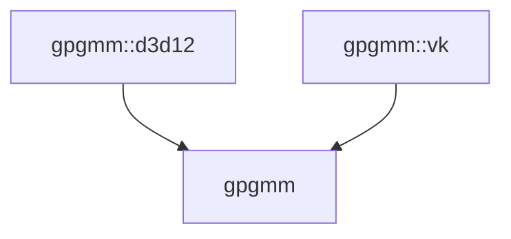
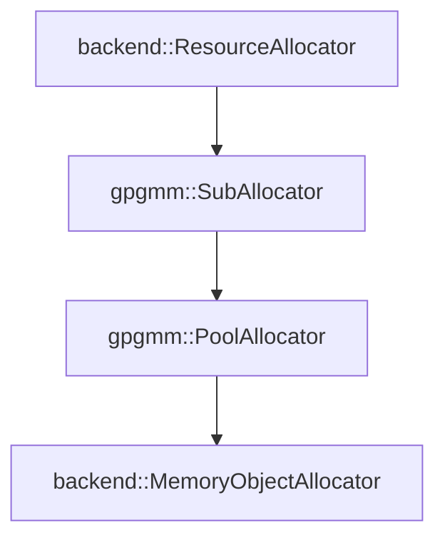
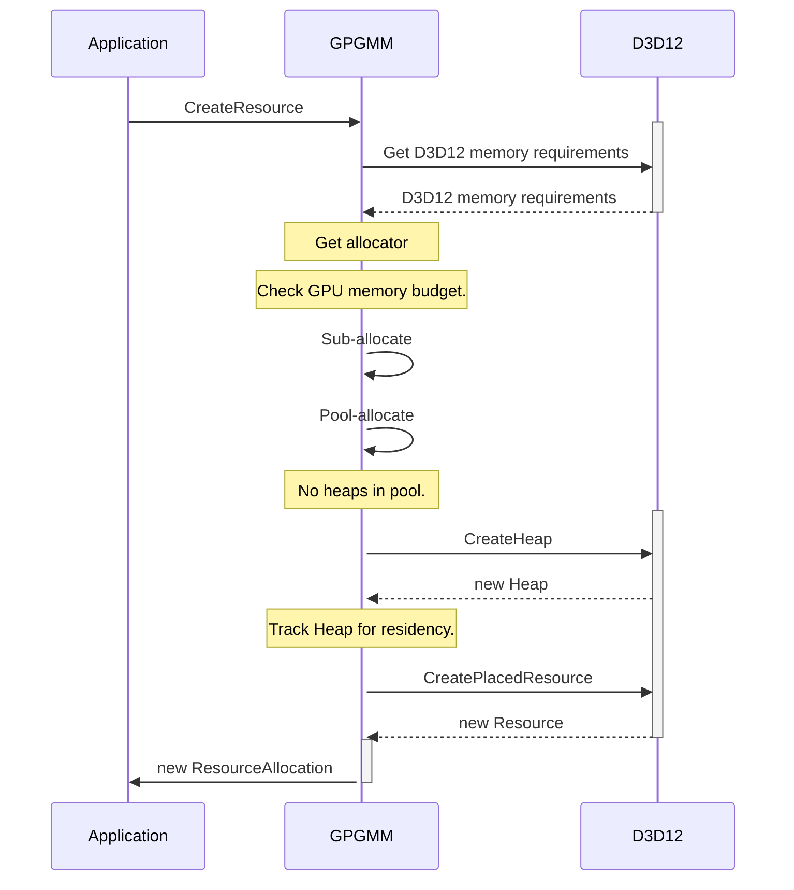

# GPGMM

General-Purpose GPU Memory Manager.
## Introduction

Next generation 3D graphics and computing APIs (D3D12, Vulkan) offer more control of GPU memory management (GMM) to the application developer than previous generation APIs (D3D11, OpenGL). The responsibility to manage GPU memory has increasingly transitioned into the application domain.

However, unless application developers become experts in GPU memory management, creating an optimal GMM, for a variety of GPU hardware, becomes hard to achieve. Complicating matters, GPI APIs are increasingly being asked to combine multiple usages together, for example, 3D rendering and ML, each with unique GPU memory patterns to optimize for.

GPGMM provides an easy to integrate, cross-platform, full memory management solution, which exposes itself to application developers in the simpler style of the older GPU APIs but leverages newer GPU API capabilities, either automatically or through application developer-friendly knobs.

More specifically, GPGMM provides:
* A "no overhead" resource management API, for easy app integration.
* Ability to manage GPU memory for multiple users within process or per process.
* A full memory management system for any application type (AAA game vs browser vs ML runtime).

## Potential Solutions

1. GPU Memory Manager per application.

Each application comes up with their own GMM solution using the tools provided by the graphics and compute API or worse, has no solution at all. For trivial projects (ex. graphics-only), a roll-your-own GMM is often simplest and easier to troubleshoot.

However, this approach restricts itself to having a single GMM made specific for *that* application, it cannot be easily reused for other projects or usages.

2. 3rd party allocator and residency library.

GMM becomes spread out across projects, by different authors, with various degrees of OS support (residency requires multiple implementations depending on OS version). Since allocators and residency are in seperate libraries, neither can help each optimize each other (avoiding large heap sizes). This also performs best for single-process applications since multiple GMMs per process, are inherently inefficient since they will battle each for available GPU memory.

3. Create a unified GPU memory manager.

Unified GMMs are not lightweight but are able to handle multiple users at once: offering incremental portability, sharing of code between projects or backend APIs, with cooperative memory sharing at the lowest level. However, a single code base also means bugs could be shared too.

This was the chosen design of GPGMM.

## Assumptions

* Application developer may not (ever) configure the GMM, it must be "good enough".

## Constraints / Limitations

 * Only resource memory (buffer and texture) is managed. Other memory object types, like descriptor heaps, are too app-specific.
 * Allocation requests could be of any possible size and duration.

## System Design and Architecture

GPGMM is called General-Purpose because the GPGMM runtime is not setup to work best for a specific application type. Instead, the application developer configures GPGMM, using the GPGMM API and knobs, to target for a particular application scenario with desired performance characteristics (high-perf vs low-mem).

Internally, GPGMM provides a GPU memory model abstraction to enable multiple GPU APIs.

| GPU API                  | GPGMM-to-Backend Memory Model     |
| -------------------------| -----------------|
| D3D12 | Memory Object (GPGMM "Managed" Heap) = Committed resource or `D3D12Heap`, GPGMM resource allocation (GPGMM Memory allocation) = Non-committed (ex. placed) resource or offset-only |
| Vulkan | Memory Object = `vkDeviceMemory`, GPGMM memory allocation = offset-only |

### System diagram or flowchart

GPGMM component is split into a back-end (or per GPU API) and "front-end" (common or code shared across back-ends) sub-components. The front-end has no dependency on the back-end. There can one or more back-ends per GPU API, but only a single front-end.

### Terminology and components

*Allocation*. A handle-like object that refers to a location, non-overlapping memory region, into GPU addressable memory.

*Sub-allocation*. A allocation that was created from from sub-dividing a Allocation.

*Memory Block*. Describes a smaller byte-addressable region (offset and size) in Allocation.

*Residency*. Residency refers to process of "making memory resident" or available to the GPU. Once GPU memory is available, is considered "resident".

*Memory object*. Represents indivisible GPU memory created by the underlying GPU API (ex. ID3D12Heap or vkDeviceMemory).

*Client*. A user of GPGMM that shares the same GPU (physical) device or adapter in the same process. For exmaple, a GPU client could be ML (compute) or composition (2D) or graphics (3D), or any mix.

### Hard and soft dependencies

GPGMM is distributed as source-only:
* Both public headers (.h) and private sources (.cpp) reside together.
* No additional dependencies: but needs to link to Vulkan and D3D12.
* Binaries (.lib or .so) are not distributed in favor of build targets.

### Algorithm for main components

Primary primitives in GPGMM are *allocators* and *allocations*.
#### Allocators

Allocators implement algorithms used to sub-divide memory. Allocators are *chained* together. The most expensive allocators, exist at the bottom: the frequency of use decreases as re-use increases toward the top.

For example, the first-order allocator receives the "create resource" request, then a second-order allocator maps GPU memory required for the resource to a specific Memory Block, which the final or third-order allocator services by providing an existing Memory Object from recycled memory.

#### Lifetime management

Lifetime management and traversal are trivial for allocators: bottom allocators cannot outlive top ones, dependency is post-order, no state is shared between other allocator types, and one way data-flow is enforced.

#### Allocator capabilities

Every allocator has a unique set of capabilities to service allocation requests of various sizes and lifetimes. The following table goes into further detail:

| Allocator Name           | Algorithm based on     | Allocation Type | Time/Space Complexity  | Lifetime |
| -------------------------| ---------------------- |----------------|-------------|------------|
| SlabCache Allocator (Default) | [The Slab Allocator](https://people.eecs.berkeley.edu/~kubitron/courses/cs194-24-S13/hand-outs/bonwick_slab.pdf) |  Sub-allocation |  `O(1)` / `O(pageSize)` | Arbitrary, but FIFO preferred.
| Segmented Allocator (Default) | Sorted Segmentation List |  Pool allocation | `O(Log2))` / `O(N * K)`, N heaps, K size. | Arbitrary |

#### Allocations

Allocations represent resource (texture or buffers) memory assigned to a allocated GPU memory region.

A allocation could represent:
1. A whole resource assigned to some offset in a Memory Object.
2. Offset within a resource, where the Memory Object was implicitly created.
3. A whole resource, fully contained, in it's own implicit (GPGMM-provided) or explicit (GPU API-provided) Memory Object.

#### Lifetime management

Allocations are immutable and read-only (unless debugging). Allocations cannot outlive their allocators. Otherwise, they will leak with a warning emitted. GPGMM itself will not garbage-collect or synchronize allocations with the GPU (ie. free when no longer used), *it is responsibility of the application developer to de-allocate* them.

### Example allocation creation

The following example is a flowchart of a D3D12 resource allocation:

### Service guarantees

### Out-of-Memory

GPGMM does not take extensive measures to recover from an out-of-memory event. For example, de-fragmentation by re-locating Memory Blocks to be layed out contiguously in a Memory Object (compaction).

Instead, GPGMM *prevents* out-of-memory events by maximizing re-use through optimal alignment and pooling. When a OOM event occurs in GPGMM (ex. `E_OUTOFMEMORY` or `VK_ERROR_OUT_OF_DEVICE_MEMORY`), it is most likely unrecoverable anyway.

### Robust leak detection

GPGMM detects and reports leaks at the allocation-level (vs Memory Object). Should resources persist on the device (externally created), for example, between allocators, they will NOT be falsely reported as leaks, even when imported into GPGMM. This is enabled by  `GPGMM_ENABLE_ALLOCATOR_LEAK_CHECKS`.

### **Data definition, schema design and Persistence requirements**

*Describe your data model and entity relationships*

### Caching requirements

GPGMM caches for common requests sizes. The size-cache is predefined at compile-time and supports multiple *size classes* (ex. page-multiple or power-of-two). The size-cache can be disabled by providing `GPGMM_DISABLE_SIZE_CACHE`.

### Capacity planning

TBD

### Performance requirements

| Requirement                       | Metric                                        |
| ----------------------------------| ----------------------------------------------|
| with GPGMM faster than without.   | Allocate/s                                    |
| GPGMM exceeds GMM via GPU driver  | Allocate/s, Peak memory usage (MB)            |

### Security

TBD

## API Endpoints

Public (exported) functions and symbols are in `gpgmm/include` directory, where `#include <gpgmm_*.h>` defines the GPGMM API for the particular backend API (ex. `gpgmm_d3d12.h`).

Auto-generated API documentation:
https://intel.github.io/GPGMM/

## Test Plan

| Test name                | Sub-Component                                | Coverage                                          |
| -------------------------| -----------------------------------------|-----------------------------------------------|
| Unit-test                | Front-end code only.                     | Functional/completeness, backend is mocked.   |
| End2end tests            | Both front and back-end code per GPU API | Functional/completeness, w/ GPU driver.       |
| Fuzzing tests            | Same as End2End.                         | Load/Stability, w/ GPU driver.                  |
| Capture-Replay tests     | Same as End2End.                         | Performance, w/ GPU driver.                     |

| Event                    | Tests                                       | Environment    |
| -------------------------| ------------------------------------------- |----------------|
| Per check-in             | Unit-test, End2End, Fuzzing, Capture-Replay | SW based GPU.  |

## Appendix

[Memory Management in Direct3D 12](https://docs.microsoft.com/en-us/windows/win32/direct3d12/memory-management)

[Vulkan Memory Management](https://www.intel.com/content/www/us/en/developer/articles/training/api-without-secrets-introduction-to-vulkan-part-5.html)
